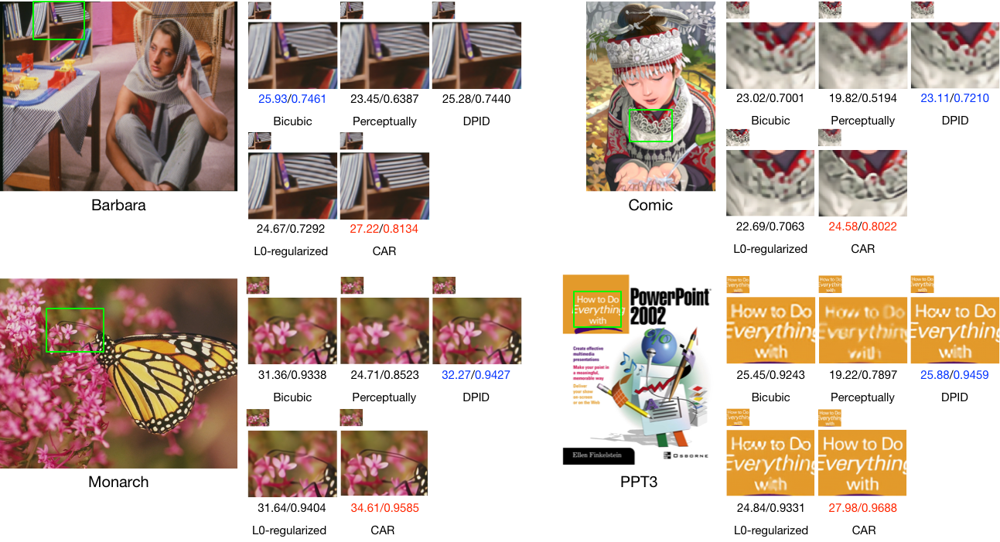

# CAR-pytorch

Pytorch implementation of paper **"Learned Image Downscaling for Upscaling using Content Adaptive Resampler"**

## Installation

	# get CAR-pytorch source
	git clone https://github.com/sunwj/CAR.git
	cd CAR
	
	# compile the code of the resampler
	cd adaptive_gridsampler
	python3 setup.py build_ext --inplace

### Python requirements
Currently, the code only supports python3 and machine with NVIDIA GPU (and the CUDA development toolkit) installed

* numpy
* scipy
* pytorch (== 1.1.0)
* Pillow
* tqdm

### Pre-trained models
You can download the pre-trained models for 2x and 4x downscaling and super-resolution from [here](https://mega.nz/#!XzIm3YhT!jbIOOOGBOiKtv3VAOD782Mz7nK1L_kma-BzR-RhboW4).

## Inference
	python3 run.py --scale 4 --img_dir path_to_images --model_dir path_to_pretrained_models \
	--output_dir path_to_output

## Sample results

You can download HR images of benchmark datasets, i.e., the Set5, Set14, B100 and Urban100 from [here](https://mega.nz/#!znBRCSJA!_qwJMP5VDe3yleiK8m0QXrpHLee9AS8vzT03lAOorP0).

## Acknowlegements
EDSR code is provided by [thstkdgus35/EDSR-PyTorch](https://github.com/thstkdgus35/EDSR-PyTorch).
